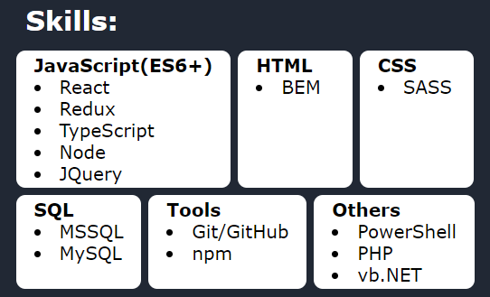
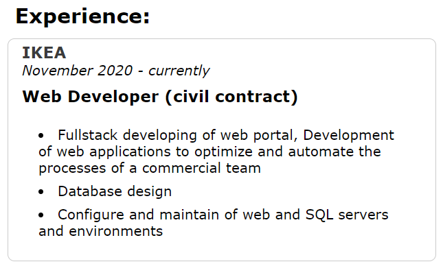

# Available Scripts

In the project directory, you can run:

### `npm start`

Runs the app in the development mode.\
Open [http://localhost:3000](http://localhost:3000) to view it in your browser.

The page will reload when you make changes.\
You may also see any lint errors in the console.

### `npm run deploy`

Builds the app for production to the `build` folder.\
and publishes to homepage (https://[user].github.io/[repo]/)

set homepage in package.json

# Data structure

## update data   
_/src/store/EN/data.js_ \
and\
_/src/store/RU/data.js_

### personal data

structure:

        personalData:{ 
                name: String,  
                title: String, 
                image: []Any, // image from /src/assets/photo/index.js
                summary: String,
                contacts:{
                        title: String,
                        content: [
                            {
                                type: String, 
                                value: String, 
                                link: String
                            },
                        ]
                } 
            },

example:

        personalData:{
            name: 'Andrey',  
            title: 'Frontend Developer',
            image: myPhoto,
            summary: 'I apply my programming skills to achieve business goals...',
            contacts:{
                title: 'Contacts',
                content: [
                    {
                        type: 'github',
                        value: 'github.com/S-404', 
                        link: 'https://github.com/S-404'
                    },
                    ]
                }
        },

preview:

### Skills

structure:

        skills: {
            title: String,
            content: [
                {
                    type: String, 
                    points: [String,]
                },
            ]
        },

example:

    skills: {
        title: 'Skills',
        content: [
            {
                type: 'JavaScript(ES6+)',
                points: [
                    'React', 
                    'Redux', 
                    'TypeScript', 
                    'Node', 
                    'JQuery'
                ]
            }
        ]

    },

preview:

### Sections

structure:

        sections:[
            {
                    title: String,
                    content:[
                            {
                                title: String,
                                period: String,
                                organization: String,
                                description: [String,],
                                achievements: {
                                    title: String,
                                    points: [String,]
                                }
                            },
                    ]
            },
        ],
    }

example:

    sections: [
        {
            title: 'Experience',
            content: [
                {
                    title: 'Web Developer (civil contract)',
                    period: 'November 2020 - currently',
                    organization: 'IKEA',
                    description: [
                        'Fullstack developing of web portal',
                    ],

                    achievements: {
                        title: 'Achievements',
                        points: []
                    }
                },
            ]
        }
    ]

preview:

### About

structure:
    
        about: {
            title: string,
            content: [{type: string, value: string},]
        },

example:

        about: {
            title: 'About me',
            content: [
                {
                type: 'web development',
                value: 'Joined web application development in 2020'
                },
            ]
        },

preview:

